# Greedy-Panicky--Grab-Those-Patty Final Report
## Video Report
 

  <iframe src="https://www.youtube.com/embed/aGmrlq8siWY" frameborder="0" allowfullscreen></iframe>

 

## Project Summary
### Background Story:
  Mr. Panicky, our protagonist, is a guy who loves apples and is afraid of bugs. Unfortunately, he has an evil boss who loves to trick Mr. Panicky. One day, the evil boss left pool Panicky in a place surrounded by his favorite apples, scary lethal endermite and hot lava. To survive, Panicky could not be caught by endermites nor step into lavas. Surviving longer is the main goal and getting apples can be a bonus.

### Settings of the World:
  In this world, apples and lavas are randomly generated at the beginning of each mission, the number of the endermites will increase if reach the spawners, and endermites will chase the agent when agent is not far from them.
  
### Goals:
  The main goal of the project is to train the agent to gain high scores in any maps: make movements without falling into lavas or getting caught by endermites; at the same time,get as much apples as possible.

  To achieve this goal, we setted up three goals in order to train the agent:
    1. Use A* policy to find the best angle to avoid lavas and reach apples;
    2. Find a balance between A* policy and the best angle policy to make the agent performs better (best angle policy was provided by mob_fun.py);
    3. Modify the policies to make the trained agent perform better.
    
### Challenges and Solutions:
1. The environment is complex: there are lavas, endermites and apples, in which case, the agent needs to avoid lavas and endermites and get apples. One policy can be hard to do everything.
        Solution: divide the problem into three parts:
              a. Run away from endermites and get apples: use the best angle policy from mob_fun.py to calculate the angle according to the position of endermites and the agent;
              b. Avoid lavas and get apples: use A* policy to find the best angle to avoid the lava and get the apple;
              c. Combine the two policies to solve the problem: a choose_policy function to combine the angles from both policies, and return the final angle.

2. In different situations, the weight of two policies can be different. The agent need to be trained to make the best decision.
        Solution: in the choose_policy function, we first weight two policies on the distance among the agent, and the closest lava and endermite. Then use hill climbing to find the best parameter alpha  to optimize the solution.
 
### Why AI?
  Since the task is complex and the agent needs to balance on different things, i.e. getting apples, avoiding lavas, running away from endermites, it is hard to give a simple solution to the project that can do well in any situation. Therefore, we need to use and combine AI/ML algorithms to train the agent and make it perform well in any situations (i.e. random maps).

## Approaches:
### Section 1: World setup
	
  The testing area is a 15 blocks x 15 blocks stone platform surrounded by walls and Agent is able to run freely inside of it without the ability to jump. The main element of the map include:
	Endermite spawner: It keeps generating the endermites, which are the enemy. Agent can walks safely on it, and thus can be regarded as stones.
	Lava: A block of lava that at the same level as the ground, which forms a pit. If agent steps on to it, it will fall into the pit and burn to death. Agent can use a matrix stores in the code to find out where the lava blocks are.
  Endermites: A groups of endermites will chase and attack the agent. Their speed are similar to the agent and their damage is one heart. The agent finds endermites by the instantaneous observation of the world and tries to avoid them as much as possible.
	Apple: Apples are served as the reward. Getting one apple gives 100 points. The agent finds the apple by observation and it is trying to get as much apple as possible.
 
  The map is randomly generated for each test. The proportion of lava blocks in the map and the number of the apples are given in order to generate a map. The map generator includes mainly two parts: randomized part and the constant part
 
#### Randomized part: 
  The position of lava and apples are randomly generated using the built-in random number generator in Python. 
  For each block in the map, the output of a Bernoulli-distributed random number generator will determine whether the block contains lava or not. However, to make sure the test is usable and meaningful, the agent’s spawn point and those 8 blocks that surrounding it will never be lava. With that exception, the probability of a block being lava (i.e. the probability of Bernoulli-distributed random number generator returns 1) is set to be equal to the proportion of lava in the map. Here is the pseudo code: 
  
   
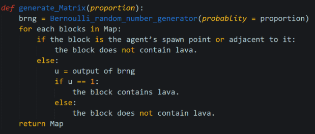  

  The position of apple is decided by the built-in random integer generator in Python. The algorithm will avoid putting an apple at a lava block. Here is the pseudo code:
  
   
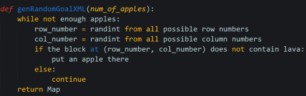  

  Constant part:
	The position of endermite spawner and the location of the agent’s spawn point are fixed. 
	The agent’s spawn point is at the center of the map (x=0.5, y=207 z=0.5) and the spawners of endermite will be located at the outermost rows and columns of the map and the center 3x3 grid of the map. Since the agent can walk on the spawner with no damage, the spawner can be considered the same as stone.
 
Here is an example of map:
  
    
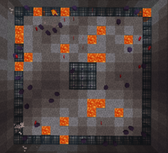  

  The dark purple dots are the endermites, red ovals are apples, the blocks with orange and yellow color contains lava and the blocks with grids are the spawners.
 
### Section 2: Baseline
 
Since this project is based on the mob_fun.py given in Malmo, The baseline of will be using the given Best-angle algorithm only (which will be described in detail in section 2). Best-angle algorithm has a decent performance when there is no lava in the map, and its performance drops as the lava appears. For more details on the actual performance, check the evaluation section.
 
### Section 3: Algorithm 
 
Currently, we divide the algorithm into three parts: a best-angle algorithm, A* algorithm, and hill-climbing algorithm. 

#### Best-angle Algorithm
The best-angle algorithm is used to avoids endermites. It evaluates all the possible by the distance to the endermite and apple and the difference between the new angle and the direction that the Mr. Panicky is currently facing. The angle with the best score (facing towards the apple, away from endermites, and requiring less change) will be chosen to be the final result. In terms of the method to calculate score, each entity is given a value by: (reward)/(distance^4) so that we pay more attention to nearby apples or nearby endermite.
Pseudo code:
  
    
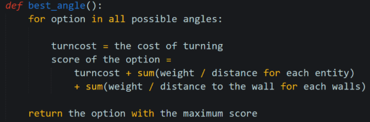  
  
#### A-star algorithm 
The A-star algorithm is used for finding the path from the current block to the closest apple. Given the location of lava blocks and apples, it returns a shortest path from current block coordinate to a apple. However, we also implement a feature to limit the depth of A star algorithm; that is, the algorithm will stop looking for the next state if it is too far away from the start. 
 
Comparing to Dijkstra algorithm and greedy-first search algorithm, A star algorithm is usually better, even though their structure are very similar. The reason of that is the estimated cost mechanism. 
 
When deciding which state to explore next, Dijkstra algorithm will only consider the distance from start to a state. It will guarantee the algorithm to output the shortest path but it does a lot of useless exploration if you are looking for a path from start to a specific destination. 
Greedy-first search algorithm takes another approach, as it explores the state with the lowest estimate cost to the destination. It reduces a lot of useless exploration, but the result may not be optimal. 
 
A star, however, considers both. It has takes the sum of the distance from start to a state and a heuristic function to estimate cost of the distance from that state to the destination. The summation is assigned to the state as its value and the algorithm will always look for the state with the best value to explore. With the right heuristic function,it can find a good path with reduced amount of state to explore. Thus, finding a good heuristic function becomes the critical part of this algorithm.
 
Following paragraphs are the details of the algorithm.

##### Overall
A star algorithm will look for the unvisited state with the minimum estimated cost from start to the goal going through this state. Then, it will explore its surrounding and update their estimated cost. The algorithm will repeat this process until it found the path to the goal or there is no more unvisited state.
 
Here is the pseudo code:
  
    
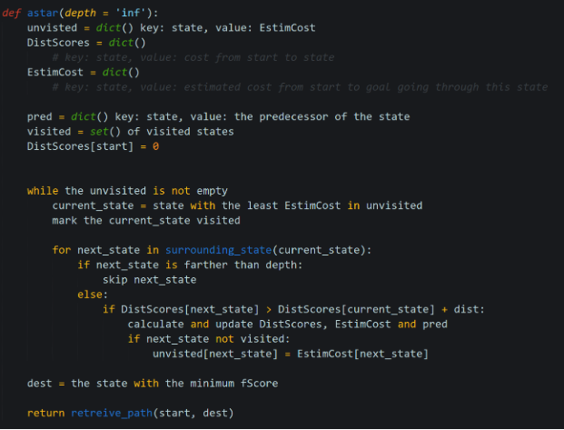  
 
##### Heuristic function
The heuristic function estimates the cost from a state to destination. It is determined by the distance from the state to an apple and its distance to lava. Here is the pseudo code:
  
    
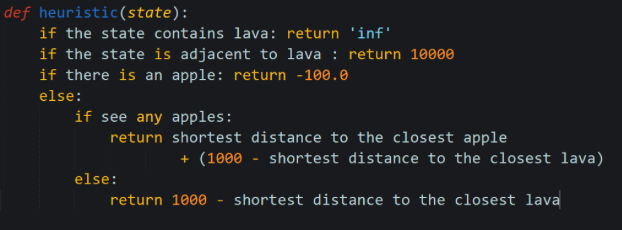  
  
##### Distance function
The distance from start to a states is determined by their modified Manhattan distance and the turn that agent need to make. Here is the pseudo code:
  
    
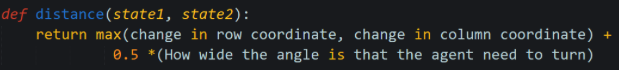  
  
#### Choose_policy function
 
##### Distance function (weight policies based on distance)
To make it easier to be calculated, we first put all items into a 16x16 map by transforming their detailed positions (positions of x-axis and z-axis) to indexes of 2d-list. For example, as it shown in the screenshot, any item in a certain grid has the index of that grids. Some endermites in the same grid share the same index. 

    
  

However, we find the agent did not perform as good as we expected, so we decided to use the (x,z), i.e. the detailed coordinate, to make the weight more precise.
After collecting the positions of the agent, all the endermites and lavas, the function will calculate the distance between each pair of agent and endermite, and each pair of agent and apples, find the minimums, i.e. the distance between the agent and the closest lava/endermite. For the minimum distance between agent and lava, w, and the minimum distance between the agent and endermite, m, the function weight on the A* policy by _w=m/(m+w). The pseudocode is shown as below,

    
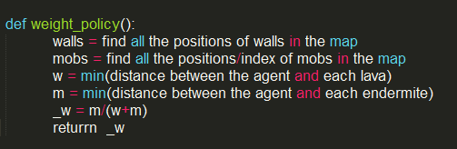  
  
To make it easier to understand, here is an example. In the case shown above, blue dots are apples, red dots are endermites, the green dot is the agent and orange blocks are the lavas. With estimation, we have w equals to 2.5 and m equals to 1.1, so we will get _w=1.1/(1.1+2.5)=11/36. 
  
    
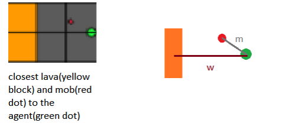  

##### Hill-climbing algorithm (old_version)
bing algorithm is used for finding the balance between the best-angle algorithm and the A-star algorithm. The agent is keep learning from the current map of how danger its lava and endermite is so that he can assign proper attention to both of them. For example, if a map contains more lava than usual, the agent will learn from previous lava damage and be more careful with lava than endermite next time in the same map. Hill-climThe logic of implementing this is keeping track of lava-damage and endermite-damage. The initial weight is 0.5, which means we are not biased against any of the strategies. But with the game proceeds, the weight will be calculated by (total_lava_damage/total_mob_damage)*normalization_factor.
 
##### Hill-climbing algorithm (current_version)
The previous hill-climbing algorithm suffers from performance issue due to complexity of the map, and we react by developing this updated hill-climbing algorithm. The new version is still based on lava damage and mod damage, but the under-the-hood implementation is completely different. In this updated version, we first try some random alpha value and record the command and reward. After we have gathered enough reward information from some broad tries, we then focus on pursuing local maximum by maintaining the same alpha if our step is currently improving. Or, if the previous step is worsening the scenario, we will increase or reduce alpha by a step unit, depending on which one of lava and mob causes more damage. 
The pseudocode is shown as below,

    
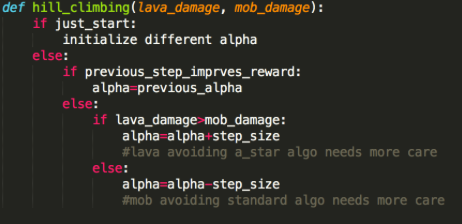  

## Evaluation
### Conclusion 1: Combined strategy outperforms baseline strategy 
The “combined strategy performance” stands for the combined performance of a-star policy and best-angle policy combined with choose-policy function in which a hill-climbing algorithm is properly integrated. We will compare this combined strategy performance with baseline performance. Baseline performance, as mentioned before, is the performance that only uses  best-angle policy. The following graph is the their comparison in terms of total score:

    
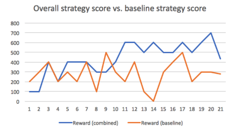  
  
In this graph, x-axis is number of iterations we run on a randomly generated map, y-axis is the score (number of apples) we got during that iteration. The baseline strategy shows an average of 280 while combined strategy shows an average of 435. The following graph is another comparison of combined strategy between baseline strategy in terms of surviving rounds from the same 20 runs. 

    
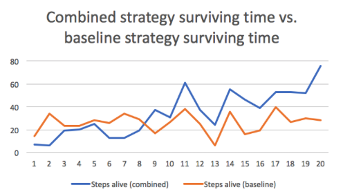  
  
In this graph, x-axis is number of iterations we run on a randomly generated map, y-axis is the surviving time unit (steps) we got during that iteration. The baseline strategy shows an average of 26 while combined strategy shows an average of 34.3. Such an improvement shows when a-star is combined with best-angle policy properly, it can significantly outperform best-angle strategy alone, both on reward side (apples collected) and on surviving time side.
 
### Conclusion 2: Hill-climbing algorithm is working properly
Hill-climbing is the main focus of our post-midterm effort and the previous two graphs also proves its effectiveness in practice qualitatively. In the two previous graphs, both of the blue lines has a uplifting trend, which means the more iterations happen in the same map, the longer the agent will survive and the more award he will collect. Each iteration is independent except for the parameter alpha so it implies alpha contributes to the agent’s learning and improving manner. 
 
As a supplement material to prove alpha is doing its “mountain climbing” job correctly, the following is alpha’s value from the same 20 runs.

    
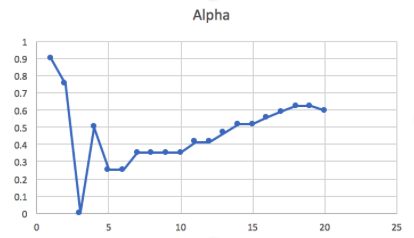  
  
Alpha stabilizes after 20 runs. Such a trend reflects our implementation: in the first several (5) rounds, we randomly initialize alpha to have a broad view. After 5 rounds, alpha finds its “uphill” and converges to its local maxima by keep adding a step size or remained unchanged depending on situation is worsening or improving. 

## References: 

Amit’s A* Pages http://theory.stanford.edu/~amitp/GameProgramming/ 

Priority dictionary: modified, used in A* algorithm:
	http://www.ics.uci.edu/~eppstein/161/python/priodict.py 

Mob fun: fundation of this project:
	Malmo\Python_Examples\mob_fun.py

Voice for the video:
	http://ttsreader.com

  

