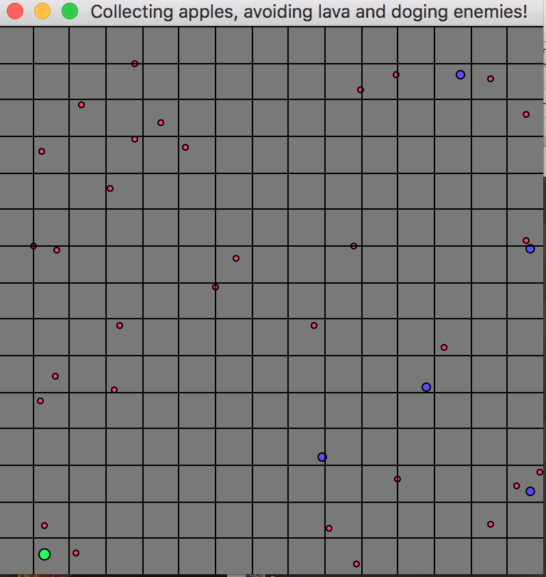
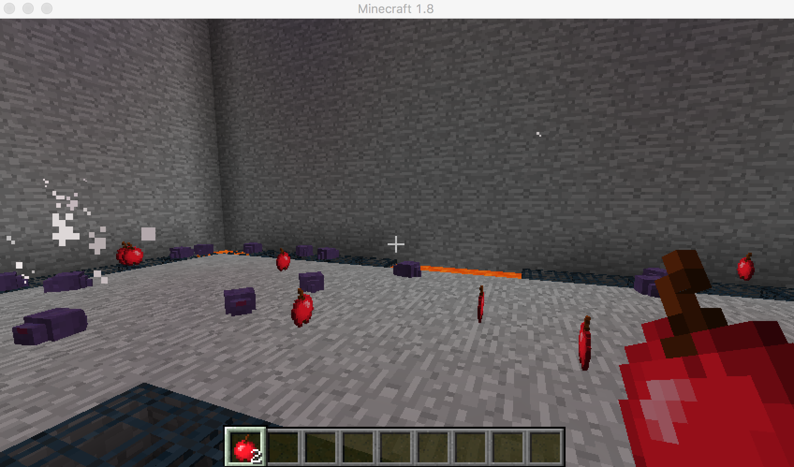

# Greedy-Panicky--Grab-Those-Patty
An AI project for Minecraft[1.8] game. The agent is trained to collect apples, escaping from pursuing enemies, and avoiding lava blocks all at the same time. Based on A-Star algorithm and Malmo framework.

## Background
Mr.Panicky loves eating apple but he is afraid of bugs. One day, he stole some apples from his boss, Mr.Mean, and unfortunately, got caught. Mr.Mean then put him into a cube full of maneating endermite as a punishment. Luckily, he found he is not only surrounded by endermites, but also his favorite apples! Now starts Mr.Panicky's journey of surviving from endermites while collecting as many apples he can without falling into lava!

## Objective
Designed and implemented an AI agent whose objective is collecting positive rewards (apples) while doging negative rewards (endermites and lava).

## Approach
Applied A-Star searching algorithm to collect positive rewards (apples) and dodge negative rewards (lava) based on current position and expected costs (steps) to goals; Utilized dynamic angle-distance algorithm (provided in mob_fun.py by Malmo) to pursue positive rewards (also apples) and dodge negative rewards (endermites); Then balanced two policies' output by a voting function. For more details please refer to Status page.

## Game Screenshot
Game board layout (green: agent, blue: apples, red: endermites):

Actual game UI:

## Links
Website: https://leoll1020.github.io/Greedy-Panicky--Grab-Those-Patty/

Video: Placeholder

- [team][team ref]. List of all team members.
- [proposal][proposal ref]. The proposal for the project, include summary of the project and evaluation plan.
- [status][status ref]. Status report for the project.

[quickref]: https://github.com/mundimark/quickrefs/blob/master/HTML.md
[proposal ref]: proposal.html
[status ref]: satus.html
[team ref]: team.html

Credits to Yiqiao Zhao, Chen Lu, Xiyue Zhang
